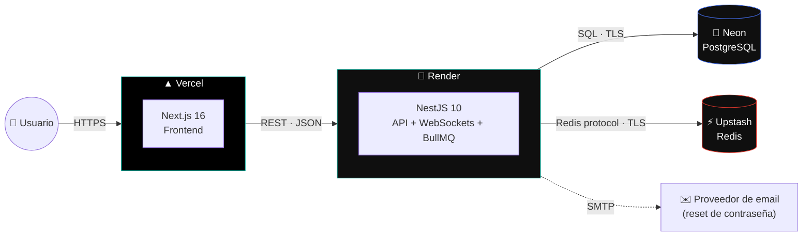

<div align="center">


# NexusCRM

### El CRM que un equipo de ventas realmente usaría — no una maqueta.

Multi-tenant, con roles reales, tiempo real, colas en background y un sistema de diseño construido desde cero. De punta a punta: base de datos, API, frontend y despliegue en producción.

<br/>

[](#)

**org:** `demo` &nbsp;·&nbsp; **email:** `demo@nexuscrm.io` &nbsp;·&nbsp; **password:** `Demo1234!`
&nbsp;— o entra directo con el botón **"Explore the live demo"** en el login, sin registrarte.

<br/>


</div>

<br/>

## Por qué este proyecto

La mayoría de los CRM de portafolio son un CRUD con login. Este resuelve los problemas que aparecen cuando el producto tiene que sostenerse solo:

- **Multi-tenancy real** — cada organización está aislada a nivel de base de datos; el mismo correo puede existir en dos empresas distintas sin chocar.
- **Permisos aplicados en el servidor**, no solo escondidos en la UI — un `VIEWER` que intenta mover un negocio por la API directamente recibe un 403, sin importar lo que muestre el frontend.
- **Nada bloquea el request principal** — emails, recordatorios de tareas y notificaciones corren en colas de BullMQ, no en línea dentro del controller.
- **Tiempo real de verdad** — WebSockets, no polling: mover un negocio lo actualiza al instante para todo el equipo.
- **Sistema de diseño propio**, no una plantilla de shadcn sin tocar — paleta, tipografía y hasta la marca están diseñadas y documentadas ([ver el porqué](./front/app/globals.css)).
- **Bilingüe de verdad** — español/inglés en toda la app, incluso antes de iniciar sesión, no solo tres textos traducidos.
- **Desplegado con una arquitectura real de producción** — no "corre en mi máquina": tres proveedores distintos, cada uno elegido por una razón concreta (ver más abajo).

<br/>

## Vista previa

<!-- Reemplaza esto con capturas reales una vez desplegado — dashboard, kanban y analytics son las tres pantallas más representativas -->

|  Dashboard  |  Pipeline (Kanban)  |  Analytics  |
|:---:|:---:|:---:|
| _captura pendiente_ | _captura pendiente_ | _captura pendiente_ |

<br/>

## Arquitectura de despliegue

Cuatro proveedores, cada uno elegido específicamente porque su plan gratuito **no expira ni se borra** — nada de pruebas de 30 días. Este diagrama es literalmente cómo corre la demo en vivo ahora mismo:



| Capa | Dónde vive | Por qué esa elección |
|---|---|---|
| **Frontend** | [Vercel](https://vercel.com) | Hecho por el equipo de Next.js — despliegue sin configuración, gratis de forma indefinida |
| **API** | [Render](https://render.com) | Free tier permanente. Se duerme a los 15 min sin tráfico y despierta en 30-60s — compromiso razonable a cambio de $0/mes para siempre |
| **Base de datos** | [Neon](https://neon.tech) | Postgres serverless, plan gratuito **permanente** — a diferencia del Postgres gratis de Render, que se **elimina a los 30 días** |
| **Redis** | [Upstash](https://upstash.com) | Redis serverless, plan gratuito permanente (256 MB / 500K comandos al mes), usado por BullMQ y por el cache de analytics |

> 📍 **Demo en vivo:** frontend en `https://[tu-app].vercel.app` · API en `https://[tu-api].onrender.com`
> _(reemplazar con las URLs reales una vez desplegado)_

<br/>

## Funcionalidades

<table>
<tr><td width="50%" valign="top">

**Pipeline**
- Kanban drag-and-drop entre 5 etapas
- Historial completo de cada cambio de etapa
- Métricas de valor y tasa de conversión por etapa
- Creación rápida de cliente sin salir del formulario de negocio

**Clientes y tareas**
- Tablas con búsqueda, filtros y paginación real (server-side)
- Tareas vinculadas a negocios y responsables
- Vista de detalle de cliente con sus negocios y tareas reales

</td><td width="50%" valign="top">

**Equipo y seguridad**
- Roles Owner / Admin / Member / Viewer aplicados en cada endpoint
- Invitaciones por email, activación de cuenta, desactivación
- Recuperación de contraseña con token de un solo uso (30 min de vida)

**Analítica y producto**
- Conversión, valor de pipeline y rendimiento del equipo por rango de fechas (incluso personalizado)
- Notificaciones en tiempo real vía WebSockets
- Onboarding guiado la primera vez, reabrible desde el header
- Español/Inglés en toda la aplicación

</td></tr>
</table>

<br/>

## Stack técnico

| Capa | Tecnologías |
|---|---|
| **Frontend** | Next.js 16 (App Router) · React 19 · TypeScript · Tailwind CSS v4 · Radix UI · Framer Motion · TanStack Query & Table · React Hook Form + Zod · Zustand · Recharts |
| **Backend** | NestJS 10 · TypeScript · Prisma 5 · PostgreSQL · Redis (BullMQ + cache) · Passport JWT · class-validator · Socket.IO |
| **Infraestructura** | Vercel · Render · Neon · Upstash — ver diagrama arriba |

<br/>

## Estructura del repositorio

Monorepo de dos aplicaciones que se despliegan **por separado**, cada una a su propio proveedor:

```
crm/
├── front/          App de Next.js  → se despliega en Vercel
├── back/           API de NestJS   → se despliega en Render
├── render.yaml      Blueprint de infraestructura-como-código para Render
└── LICENSE
```

<br/>

## Correrlo en local

Requiere Node 20+, PostgreSQL 15+ y Redis 7+ (o Docker — ver `back/docker-compose.yml`).

```bash
git clone <url-de-este-repo>
cd crm

# ── Backend ──────────────────────────────────────────────
cd back
cp .env.example .env        # completa DATABASE_URL, secretos JWT, etc.
npm install
npx prisma generate
npx prisma migrate deploy   # aplica todas las migraciones
npm run prisma:seed         # crea la organización demo + acme-corp
npm run start:dev           # → http://localhost:3001

# ── Frontend (nueva terminal) ────────────────────────────
cd front
cp .env.example .env        # NEXT_PUBLIC_API_URL=http://localhost:3001
npm install
npm run dev                 # → http://localhost:3000
```

Detalles de endpoints y variables del backend en [`back/README.md`](./back/README.md).

<br/>

## Despliegue a producción

Guía completa paso a paso (Neon → Upstash → Render → Vercel, en ese orden porque cada servicio depende del anterior) en el mensaje de configuración de este proyecto — o sigue la tabla del diagrama de arquitectura de arriba, que enlaza directo a cada proveedor.

<br/>

## Decisiones de ingeniería

Algunas elecciones deliberadas, por si el porqué importa tanto como el qué:

- **Neon + Upstash en vez de los add-ons gratis de Render** — el Postgres y Redis gratuitos de Render se borran a los 30 días. Para un link de portafolio que necesita seguir vivo, eso no sirve; Neon y Upstash sí son gratis de forma permanente.
- **BullMQ en vez de procesar todo en el request** — enviar un email o generar una notificación dentro del controller hace que la respuesta HTTP espere a un proveedor externo. Encolarlo desacopla la latencia del usuario de la disponibilidad del servicio de correo.
- **RBAC en guards de NestJS, no en `if` sueltos** — los permisos viven en un solo lugar (`lib/permissions` en el front, guards + decoradores en el back) y se aplican de la misma forma en cada endpoint, en vez de reimplementarse por feature.
- **Tokens de reseteo de contraseña hasheados con SHA-256, no guardados en texto plano** — el mismo patrón que ya usaba el refresh token del proyecto, extendido de forma consistente.
- **Diseño construido desde los tokens hacia arriba** — un solo archivo (`globals.css`) define color, tipografía y geometría; cambiar la paleta ahí se propaga a más del 95% de la interfaz sin tocar componentes, porque cada componente ya consume variables CSS en vez de colores sueltos.

<br/>

## Licencia

MIT — ver [LICENSE](./LICENSE).